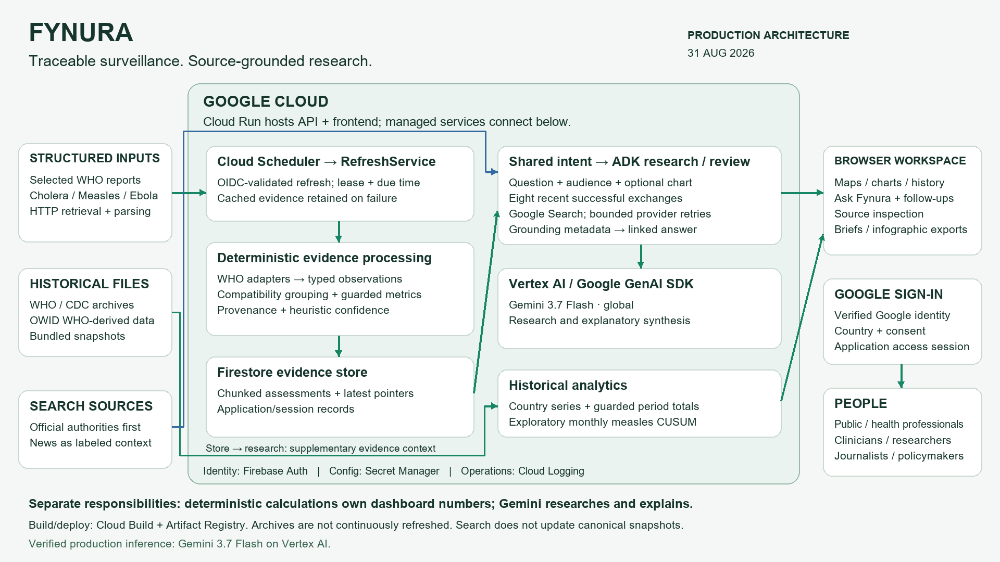

# Fynura

**See the signal sooner.** Source-linked public-health surveillance and an interactive research partner.

[Hosted app](https://fynura-g7sjcbc4ua-uc.a.run.app/) · [User docs](https://fynura-g7sjcbc4ua-uc.a.run.app/docs) · [Project overview](docs/submission/README.md)

## Architecture



Two connected paths run in one FastAPI application:
- **Deterministic surveillance:** scheduled WHO retrieval, typed extraction, compatible evidence grouping, guarded calculations, confidence scoring and Firestore snapshots.
- **Agentic research:** Google ADK research and conditional source-review agents, using the Google GenAI SDK, Vertex AI and Google Search. Optional chart context and eight recent successful exchanges support follow-ups.

The active research default is **gemini-3.7-flash**, Vertex location **global**. `FYNURA_CHAT_MODEL` is the single model setting; legacy readers use the same value. The four-role SequentialAgent in `backend/agents/root_agent.py` is defined but not called by the production refresh path.

See [architecture explanation](docs/submission/ARCHITECTURE_EXPLANATION.md).

Both chat endpoints share intent routing: source-registry questions use application state; surveillance questions retain deterministic metrics and confidence; scientific and capacity-building questions use research independently of the selected chart. Safe methods questions without live source support may receive a clearly labeled general scientific explanation, with no invented citations or surveillance-confidence percentage. Current outbreak claims never use that fallback.

## Prerequisites

- Python 3.11+ (Docker image uses Python 3.12).
- Git; optional Node.js for two frontend checks.
- Google Cloud CLI and Application Default Credentials for real Vertex research.
- A Google Cloud project with billing, Vertex API access, appropriate quota and model availability.
- Docker if building locally; Cloud Run source deployment can build remotely without local Docker.

## Local setup and installation

```sh
git clone https://github.com/onovo007/Fynura.git
cd Fynura
python -m venv .venv
```

Windows PowerShell:
```powershell
.\.venv\Scripts\Activate.ps1
Copy-Item .env.example .env
python -m pip install -e ".[dev]"
```

macOS/Linux:
```sh
source .venv/bin/activate
cp .env.example .env
python -m pip install -e ".[dev]"
```

Keep credentials and private configuration out of version control.

## Environment variables

Edit your local `.env` using the placeholders in `.env.example`.

| Variable | Purpose |
|---|---|
| GOOGLE_CLOUD_PROJECT | Your project ID; needed for Vertex/Firestore |
| GOOGLE_GENAI_USE_VERTEXAI | TRUE for Vertex integration |
| GOOGLE_CLOUD_LOCATION | Regional services, usually us-central1 |
| FYNURA_CHAT_MODEL | Actual research model, currently gemini-3.7-flash |
| FYNURA_CHAT_LOCATION | global for the deployed research model |
| FYNURA_MODEL | Legacy graph setting; not research-chat selection |
| FYNURA_USE_FIRESTORE | false for local in-memory storage; true for durable production storage |
| FYNURA_ONBOARDING_REQUIRED | false for localhost development only; true in production |
| FYNURA_ENV | development or production |
| FYNURA_OWNER_EMAIL | Optional administrator email allowlist |
| FYNURA_FIREBASE_API_KEY | Firebase web app configuration; production loads through Secret Manager |
| FYNURA_AUTH_DOMAIN | Your Firebase auth domain |
| FYNURA_SESSION_DAYS | Firebase session-cookie lifetime; application access sessions also have their own expiry |
| FYNURA_LIVE_FETCH | Legacy setting; do not rely on this flag to disable all external retrieval |

## Google authentication and Gemini/Vertex configuration

```sh
gcloud auth login
gcloud auth application-default login
gcloud config set project YOUR_PROJECT_ID
gcloud services enable aiplatform.googleapis.com --project YOUR_PROJECT_ID
```

Your ADC identity needs Vertex AI access (typically Vertex AI User), service usage permissions as appropriate, and billing/quota. No Gemini API key is sent to the browser. For a runtime service account, grant only the permissions needed for the chosen deployment.

Installing the project installs Google ADK and Google GenAI SDK. No separate ADK server is required: FastAPI creates the research Runner per request. Model availability and pricing can change; check your project before use.

## Run locally

```sh
python -m uvicorn backend.main:app --host 127.0.0.1 --port 8000 --reload
```

Open http://127.0.0.1:8000 and http://127.0.0.1:8000/health.

With onboarding disabled, localhost serves the app without Firebase login. This mode is for development, **not a production access-control configuration**. Charts may retrieve public WHO data; research calls Vertex. Offline tests use fixtures, but the interactive app is not an offline demonstration.

## Database/storage setup

For local testing, `FYNURA_USE_FIRESTORE=false` uses process memory and bundled archives. Evidence and product state disappear when the process restarts.

For production, create a Firestore Native default database in the intended region and set `FYNURA_USE_FIRESTORE=true`. Grant the runtime account appropriate Firestore data access (typically Datastore User). The app creates its document collections as needed; there is no SQL migration.

Historical archives are packaged in `data/history/catalog.json.gz` and `owid.json.gz`. Scripts in `scripts/` rebuild archives from source, but do not run automatically under the scheduled current-surveillance refresh.

## Production Google sign-in

1. Add Firebase Authentication to your project and enable the Google provider.
2. Register a Firebase web app and configure authorized domains, including the Cloud Run hostname.
3. Configure OAuth audience/publishing and organizational access as appropriate; verify with a separate account.
4. Set the Firebase web configuration and owner email in deployment settings; store the API-key configuration in Secret Manager if following production.
5. Set `FYNURA_ONBOARDING_REQUIRED=true`.
6. Verify /welcome → Continue with Google → country/consent → app → Sign out.

The verified email comes from Google sign-in, not an arbitrary typed email. A Google account can use Gmail or another configured address; organizational policy may restrict access. The runtime needs Firebase permissions for session creation and any enabled administrator features.

## Tests

```sh
python -m pytest -q
node tests/frontend_heatmap.cjs
node tests/frontend_voice.cjs
```

The test suite covers evidence compatibility, historical aggregation, conversation routing, provider retries and frontend behavior. See the [reviewer guide](docs/submission/START_HERE.md) and [research architecture](docs/RESEARCH_CHAT.md). Automated tests are not clinical validation, load tests or a security certification.

Optional paid live probe, with ADC:
```sh
python tests/conversation_live_probe.py
```

## Docker build

```sh
docker build -t fynura .
docker run --rm -p 8080:8080 -e FYNURA_ONBOARDING_REQUIRED=false -e FYNURA_USE_FIRESTORE=false fynura
```

Open http://127.0.0.1:8080. This minimal container command does not mount ADC, so research requires separately configured credentials. Do not bake credentials into an image.

## Cloud Run deployment

Use your own project and runtime identity. Enable the services required by your chosen configuration: Cloud Run, Cloud Build, Artifact Registry, Vertex AI, Firestore, Secret Manager, Identity Toolkit/Firebase Authentication, and Cloud Scheduler if scheduling refresh.

Prepare the runtime service account, Firestore database, Firebase provider and secret before deploying. A representative command:

```sh
gcloud run deploy fynura --source . --project YOUR_PROJECT_ID --region us-central1 --service-account YOUR_RUNTIME_SERVICE_ACCOUNT --set-env-vars "GOOGLE_CLOUD_PROJECT=YOUR_PROJECT_ID,GOOGLE_GENAI_USE_VERTEXAI=TRUE,GOOGLE_CLOUD_LOCATION=us-central1,FYNURA_CHAT_MODEL=gemini-3.7-flash,FYNURA_CHAT_LOCATION=global,FYNURA_ENV=production,FYNURA_USE_FIRESTORE=true,FYNURA_ONBOARDING_REQUIRED=true,FYNURA_AUTH_DOMAIN=YOUR_AUTH_DOMAIN,FYNURA_OWNER_EMAIL=YOUR_OWNER_EMAIL" --set-secrets "FYNURA_FIREBASE_API_KEY=YOUR_FIREBASE_SECRET:latest"
```

An administrator must approve public Cloud Run invocation if exposing a public sign-in page; application sign-in still guards the workspace. Do not disable IAM checks as a generic workaround. Production uses public Cloud Run ingress with application authentication.

The existing `deployment/gcp/*.ps1` scripts are deployment-specific, including paths and identities. Review rather than execute them unchanged in another project. Environment replacement can drop existing values: inspect safe configuration first when updating an existing service.

## Scheduled evidence refresh

Production has an enabled 12-hour Cloud Scheduler HTTP job targeting `/internal/refresh`. The app verifies its OIDC audience and the exact scheduler identity. The current route embeds the production audience; adapting deployment to a different hostname requires reviewing that application configuration.

RefreshService uses a lease and per-threat due times (Ebola 12h; measles/cholera 24h), retaining cached evidence if a fetch fails. A scheduler success does not mean every source refreshed on that invocation.

## Data sources

Current structured surveillance: selected WHO cholera, measles and Ebola reports. History: WHO monthly measles, WHO annual cholera, CDC Ebola chronology, and OWID WHO-derived annual archives. Source registry entries for other authorities are not proof of live integration. News and additional authorities can be consulted by on-demand research; search does not update canonical observations.

Keep source attributions, reporting dates and archive retrieval dates visible. OWID republishing WHO does not create a second independent authority.

## Responsible use and limitations

Fynura is for public-health understanding, not individual diagnosis, treatment or outbreak prediction. Do not enter patient identifiers. Google sign-in and onboarding collect personal information as explained in the privacy notice; this is not anonymous use.

CUSUM is exploratory country-level historical measles screening, not an operationally validated alert. Annual cholera and separate Ebola outbreaks are not converted into monthly detection data. Research may be slow or fail to obtain linked support. Memory is eight exchanges in the open page and clears on reload. Dependency ranges are not a reproducible lockfile.

## Project overview

Explore the [project overview and gallery](docs/submission/README.md). No endorsement by source authorities is implied.

## License

Application code has an existing [MIT license](LICENSE). Source datasets and supplied photography retain their own rights and attribution requirements; the code license does not relicense them.

## Troubleshooting

- `auth/unauthorized-domain`: use the approved production hostname; a temporary Cloud Run tag is not automatically a Firebase authorized domain.
- Vertex 403: check the runtime identity's Vertex AI User permission and API availability. Do not expose or paste credentials into chat.
- Model 404: verify the configured model and location in your own project. The app does not silently fall back to an older model.
- Missing research sources: the app withholds an ungrounded answer. Try a narrower question and inspect the linked evidence; grounded text still requires critical review.
- Dictation unavailable: allow microphone access in a supported browser, review the transcript and select Send. Browser voice services are separate from Gemini.
