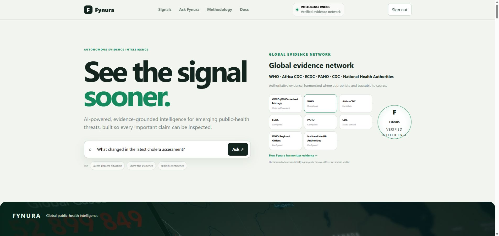
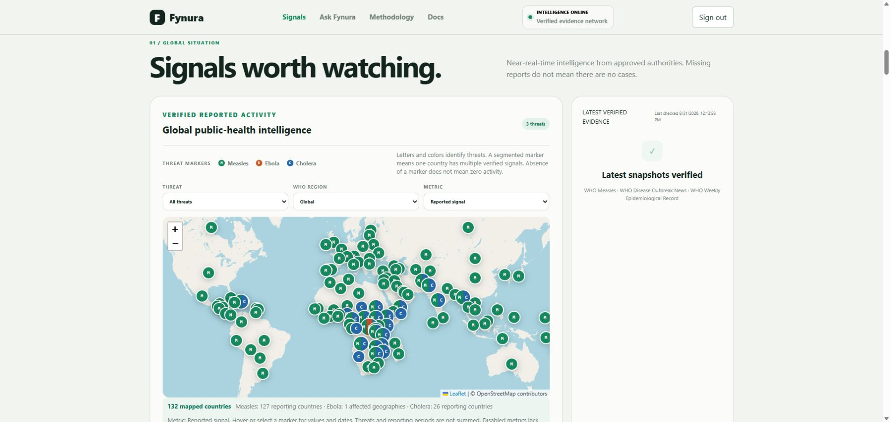
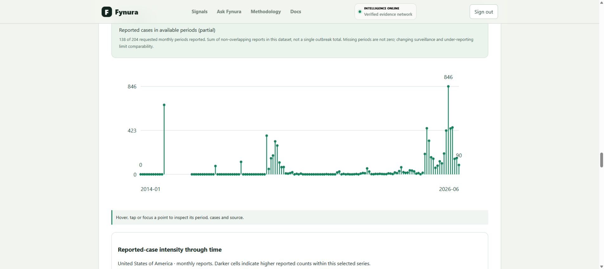
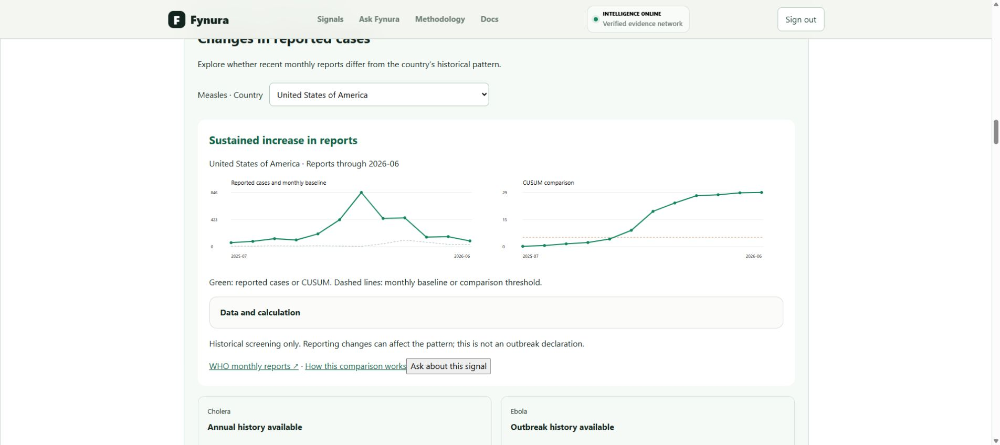
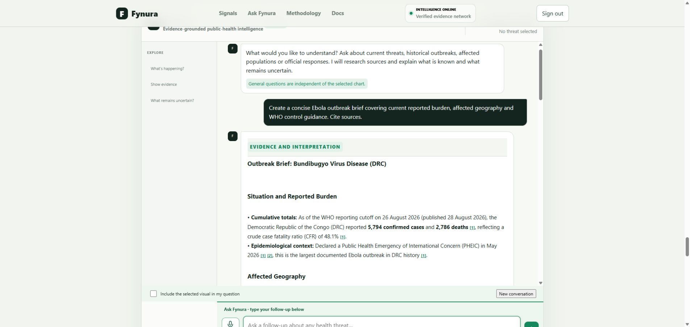

# Product gallery

These screenshots illustrate Fynura's interface. Reported values belong to the dates and scopes shown in the application, not necessarily today's reporting period.

## Surveillance workspace

## Global intelligence map

## Historical evidence

Chart detail from the United States monthly measles archive. The full application provides reporting frequency, geographic scope, source links and coverage information.

## Historical signal screening

## Source-linked research

## Exportable infographic

[View the complete infographic](media/final-infographic-full.png) · [SVG version](media/final-infographic.svg)

## Architecture

